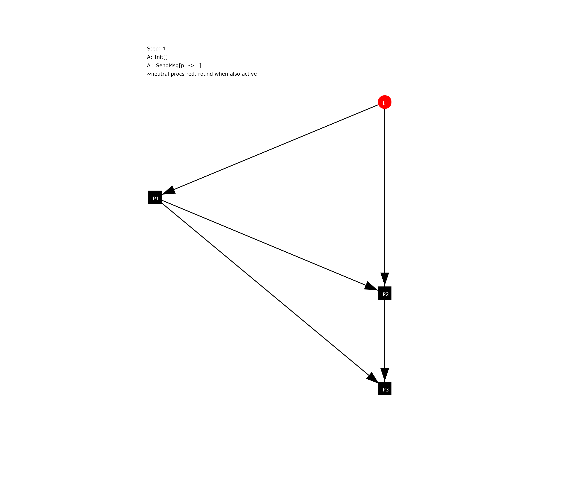

EWD687a
================
(2021-12-21)

The specifications in this directory model termination
detection given in: 

*E.W. Dijkstra, C.S. Scholten: Termination detection for diffusing
computations. Information Processing Letters, 11 (1):1–4, 1980.*

### Animation of the execution of the algorithm

Four processes             |  Six processes
:-------------------------:|:-------------------------:
  |  

Animations can be created on Linux or macOS by running TLC and pasting the output into the animator:

1. Optionally: Modify the definition `Network` in `EWD687a_anim.tla` to your liking (number of processes and edges)

2. Run TLC with `java -jar tla2tools.jar EWD687a_anim -simulate num=100 -note > EWD687a_anim.out`

3. Paste the content of EWD687a_anim.out into the text box at https://animator.tlapl.us/

Alternatively, you can paste the content of [EWD687a_anim_2.out](./EWD687a_anim_2.out) into the text box at https://animator.tlapl.us/ to control the animation with six processes.