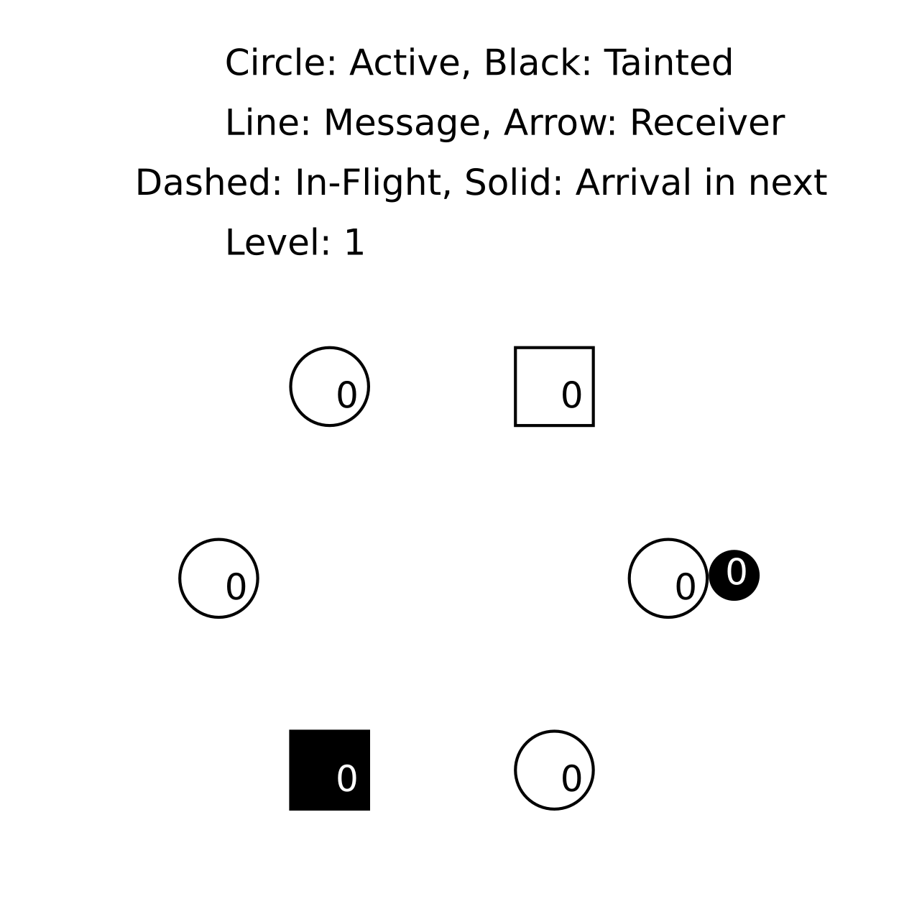
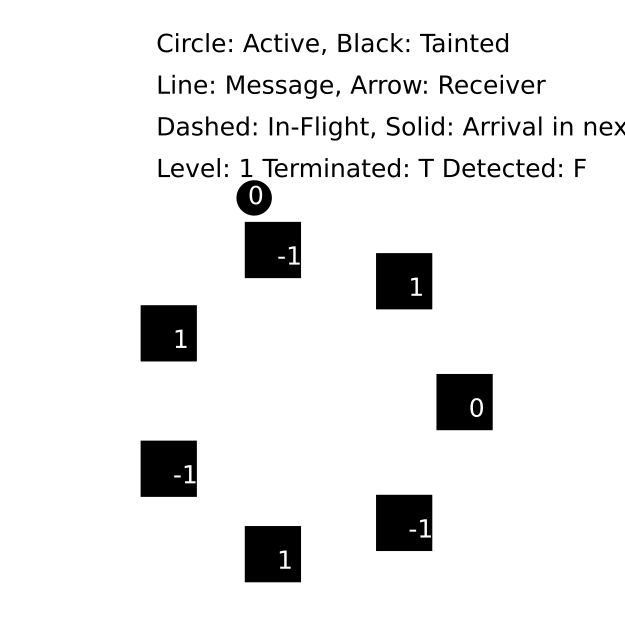
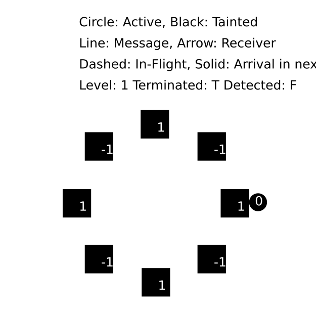

The [specification](./EWD998.tla) in this directory models termination detection in a ring as given by Shmuel Safra in [EWD 998](https://www.cs.utexas.edu/users/EWD/ewd09xx/EWD998.PDF).  EWD 998 is an extension of a simpler algorithm described in [EWD 840](../ewd840).  Compared to EWD 840, this algorithm supports asynchronous message delivery.  However, it still assumes reliable message channels and non-faulty nodes.  For TLA+ learners, it is best to study EWD840 first and then read the TLA+ spec of [EWD998.tla](./EWD998.tla).

For readers familiar with TLA+:

EWD998.tla refines the abstraction [AsyncTerminationDetection](./AsyncTerminationDetection.tla) under the refinement mapping given in EWD998.tla.  This mapping has been model-checked with TLC.  Additionally, the spec [AsyncTerminationDetection_proof](./AsyncTerminationDetection_proof.tla) proves the main safety properties for module AsyncTerminationDetection, and refinement of [SyncTerminationDetection.tla](../ewd840/SyncTerminationDetection.tla). Elsewhere, SyncTerminationDetection is refined by [EWD840.tla](../ewd840/EWD840.tla).

```
SyncTerminationDetection < EWD840
                         < AsyncTerminationDetection 
                              < EWD998
                                  < EWD998Chan
                                      < EWD998ChanID
```

The spec [EWD998Chan.tla](./EWD998Chan.tla) refines EWD998.tla by adding inboxes.  [EWD998ChanID.tla](./EWD998ChanID.tla) refines EWD998Chan.tla and replace natural numbers as node identifiers with hostnames (arbitrary strings actually).  EWD998ChanID.tla also shows how to model [vector clocks](https://en.wikipedia.org/wiki/Vector_clock) in TLA+, which [EWD998ChanID_shiviz.tla](./EWD998ChanID_shiviz.tla) exploits to visualize traces with [Shiviz](https://bestchai.bitbucket.io/shiviz/). The spec [EWD998ChanID_export.tla](./EWD998ChanID_export.tla) demonstrates how to export TLC traces to Json.  Below is an animation of the termination detection process for six nodes. It was created with [EWD998_anim.tla](./EWD998_anim.tla).



## Statistics

Because of its simplicity, EWD998 has been choosen to explore the idea of infering statistical properties by simulating TLA+ specs (with [TLC's simulator](https://tla.msr-inria.inria.fr/tlatoolbox/doc/model/tlc-options-page.html#checking)).  In a nutshell, we randomly generates traces for real-world configurations (node numbers) or workloads (global state of the system when terminated), and predict the runtime behavior of the system.  Such properties cannot be expressed with TLA+ because they are true or false of a set of behaviors; not a single behavior.  If random simulation is good enough in practice to predict statistical properties, it could help short-circuit modeling of an algorithm that currently requires empirical analysis of an algorithm's implementation.  In other words, traditionally we would model EWD998 in TLA+ and check safey and liveness properties up to proving correctness. Then, we would implement EWD998 in a suitable programming language and analyze its statistical properties by running the implementation.  If the statistical properties are unsatisfactory, we rinse and repeat and go back and optimize the algorithm.

In the case of EWD998, we pretend that we wish to study the efficiency of four different variants of the original termination detection algorithm:

1) "pt1": An *active* node may pass the token if the node is black/tainted.
2) "pt2": An *active* node may pass the token if the token is black/tainted.
3) "pt3": Return the token to the initiator, thus, abort the token round, iff the node is black.
4) "pt4": Return the token to the initiator, thus, abort the token round, iff the token is black.

pt3 and pt4 can be seen as "aborting" an inconclusive token round by directly returning the token to the initiator. The two variants come at the cost of all nodes knowing the identify of the initiator.  However, this could be addressed by stamping the initiator's id onto the token under the assumption that the underlying network allows for all nodes to send a token to the initiator (i.e. not a ring).

The way we are going to measure efficiency is by measuring the number of steps between termination of  [`Environment`](./EWD998ChanID.tla#L116-L157)  and the detection of termination by  [`System`](./EWD998ChanID.tla#L64-L112)  (see EWD998.tla for their definitions).

## Simulation

In this section, we outline the simluation of the TLA+ specs and discuss our results.

The spec [EWD998_opts.tla](./EWD998_opts.tla) extends module EWD998 (EWD998Chan actually) and, depending on the given "feature flags" `F`, enables the variants `pt1` to `pt4` in the sub-action `PassTokenOpts`:

```tla
PassTokenOpts(n) ==
  /\ n # 0
  /\ \/ ~ active[n]
     \/ /\ "pt1" \in F
        /\ color[n] = "black"
     \/ /\ "pt2" \in F
        /\ \E j \in 1..Len(inbox[n]) : inbox[n][j].type = "tok" /\ inbox[n][j].color = "black"
  /\ \E j \in 1..Len(inbox[n]) : 
          /\ inbox[n][j].type = "tok"
          /\ LET tkn == inbox[n][j]
             IN  inbox' = [inbox EXCEPT ![CASE "pt3" \in F /\ color[n] = "black" -> 0
                                            [] "pt4" \in F /\ tkn.color ="black" -> 0
                                            [] OTHER    ->  n-1] = 
                                       Append(@, [tkn EXCEPT !.q = tkn.q + counter[n],
                                                             !.color = IF color[n] = "black"
                                                                       THEN "black"
                                                                       ELSE tkn.color]),
                                    ![n] = RemoveAt(@, j) ]
  /\ color' = [ color EXCEPT ![n] = "white" ]
  /\ UNCHANGED <<active, counter>>
```

The TLC action constraint `AtTermination` sets the first element of the list equal to `TLCGet` to the ordinal of the state in which all nodes are inactive and no messages are in-flight.

```tla
AtTermination ==
    IF EWD998!Termination # EWD998!Termination'
    THEN TLCSet(1, TLCGet("level"))
    ELSE TRUE

```

The TLC state constraint `AtTerminationDetected` resets the first element of the list `TLCGet`, after writing a record to the CSV file defined by the environment variable `IOEnv.Out`.  `AtTerminationDetected` also writes the occurrences of all sub-actions in the current behavior to the CSV file (note new `TLCGet("stats").behavior.actions`), as well as the values of the constants `F` and `N`.

```tla
AtTerminationDetected ==
    EWD998!terminationDetected =>
    /\ LET o == TLCGet("stats").behavior.actions
       IN /\ CSVWrite("%1$s#%2$s#%3$s#%4$s#%5$s#%6$s#%7$s#%8$s#%9$s",
               << F, N, TLCGet("level"), TLCGet("level") - TLCGet(1),
                 o["InitiateProbe"],o["PassTokenOpts"], \* Note "Opts" suffix!
                 o["SendMsg"],o["RecvMsg"],o["Deactivate"]
                 >>,
               IOEnv.Out)
          /\ TLCSet(1, 0)
```


There is more boilerplate and re-definitions (`SomeRingOfNodes`, `InitSim`, ...) to help TLC in `EWD99_opts.tla`, but none are relevant with regards to statistics. If we wouldn't be studying pt1 and `pt2`, we could rewrite `InitSim` and `SpecOpts` to start in states where all nodes are inactive and no Environment steps are possible.

We then generate a reasonable number of traces for all elements of `(SUBSET {pt1,pt2,pt3,pt4}) \X {7,29,43}`. This is done in the TLA+ "script" [EWD998_optsSC.tla](./EWD998_optsSC.tla). The average number of token passes are plotted in the barplots below.

Note that the underlying `R` code can be found in [README.Rmd](./README.Rmd), from which this file is generated on a host with all libraries installed via the command `Rscript -e "rmarkdown::render('README.Rmd')"`.

```{r, include=FALSE}
knitr::opts_chunk$set(echo = TRUE)
library(ggplot2)
library(dplyr)
library(here)
```

```{r, echo=FALSE, warning=FALSE, message=FALSE}
## here is not consistent across platforms! Prepend "specifications","ewd998" on macOS.
data <- read.csv(header=TRUE, sep = "#", file = "EWD998_opts_688569962.csv")
summary = summarise(group_by(data,Variant, Node),
  mean_Length = mean(Length), sd_Length = sd(Length),
  mean_IP = mean(InitiateProbe), sd_IP = sd(InitiateProbe),
  mean_PT = mean(PassToken), sd_PT = sd(PassToken),
  mean_SM = mean(SendMsg), sd_SM = sd(SendMsg),
  mean_RM = mean(RecvMsg), sd_MR = sd(RecvMsg),
  mean_DA = mean(Deactivate), sd_DA = sd(Deactivate),
  mean_T = mean(T), sd_T = sd(T),
  mean_T2TD = mean(T2TD), sd_T2TD = sd(T2TD)
)
Nodes <- unique(summary$Node)
```

### Average length of suffix for which `terminated /\ ~terminationDetected` holds

```{r, echo=FALSE, warning=FALSE, message=FALSE}

for (n in Nodes) {
 ## Ideally, filtering on Variant column would not rely on string matching.
 print(ggplot(filter(summary, !grepl('pt1|pt2', Variant), Node == n), aes(x = reorder(Variant, mean_T), y = mean_T2TD, fill = Variant)) +
   geom_bar(stat = "identity") +
   geom_errorbar(aes(ymin=mean_T2TD-sd_T2TD, ymax=mean_T2TD+sd_T2TD), width=.2) +
   scale_x_discrete(guide = guide_axis(n.dodge=3))+
   theme_minimal() +
   labs(
     x = "Spec variant",
     y = "Average length while terminated /\\ ~terminationDetected holds",
     title = paste("Number of Nodes: ", n, "Traces:", nrow(filter(data, !grepl('pt1|pt2', Variant), Node == n)))
   ))
}
```

All three barplots above confirm that the average length of the suffix, for which `terminated /\ ~terminationDetected` is true, is consistently higher for feature flag subsets that include the `pt4` variant and highest for the `pt3` variant.  Additionally, we see that the signal gets stronger for larger numbers of nodes.  This could indicate that the [small-scope hypothesis](https://citeseerx.ist.psu.edu/viewdoc/download?doi=10.1.1.8.7702&rep=rep1&type=pdf) does not transfer to empirical measurements.

Plotting the average occurrences of the spec's sub-actions shows how the `InitiateProbe` and, consequently (for each `InitiateProbe` action there are `N` `PassToken` actions), `PassToken` actions increase for variants `pt3` and `pt4`.  The higher number of `SendMsg`/`RecvMsg` actions for the original spec is likely statistical noise because it's limited to `N=7`.

### Average number of sub-actions per behavior

```{r, echo=FALSE, warning=FALSE, message=FALSE}
for (n in Nodes) {
  print(ggplot(filter(summary, !grepl('pt1|pt2', Variant), Node == n)) + 
  geom_point(aes(x=reorder(Variant, mean_PT), y = mean_PT,colour = "PassToken",shape = "PassToken")) + 
  geom_point(aes(x=reorder(Variant, mean_IP),y=mean_IP,colour = "InitiateProbe",shape = "InitiateProbe")) +
  geom_point(aes(x=reorder(Variant, mean_SM),y=mean_SM,colour = "SendMsg",shape = "SendMsg")) +
  geom_point(aes(x=reorder(Variant, mean_RM),y=mean_RM,colour = "RecvMsg",shape = "RecvMsg")) +
  geom_point(aes(x=reorder(Variant, mean_DA),y=mean_DA,colour = "Deactivate",shape = "Deactivate")) +
  theme_minimal() +
  labs(
    x = "Spec variant",
    y = "Average number of sub-action occurrences in behaviors",
    title = paste(
      "Number of Nodes: ", n, " Traces:", nrow(filter(data, !grepl('pt1|pt2', Variant),Node == n))
    )
  ))
}
```

To conclude this section, differential analysis along multiple dimensions (number of nodes, spec variants) appears to be useful for predicting statistical properties of algorithmic variants.  The occurrences of sub-actions alone, hints at properties that can be studied further by instrumenting a spec as shown above.  However, even wall-clock time to simulate a fixed number of behaviors over the two dimensions number of nodes and spec variants alone, indicated the inferior behavior of pt3--running the simulator took forever to the point that it seemed stuck for `pt3` with >100 nodes.

Running statistical analysis at the algorithm/spec level should generally provide a more robust signal because many sources of noise that usually distort measurements at the implementation level do not exist.  Related, we don't fully take advantage of studying properties above the code/implementation level, because we still let the simulator generate behaviors satisfying the original behavior spec that allows `Environment` steps.  It would be faster to generate behavior by defining the set of initial states to be all states in which `terminated /\ ~terminationDetected` holds.  Unfortunately, this is infeasible because the TLC simulator generates *all* initial states upfront.  For increasing numbers of nodes, the cardinality of this set becomes astronomical (under a suitable state constraint to bound the message counters).
The [Randomization.tla](https://github.com/tlaplus/tlaplus/blob/master/tlatools/org.lamport.tlatools/src/tla2sany/StandardModules/Randomization.tla) module, [otherwise used to validate inductive invariants](https://lamport.azurewebsites.net/tla/inductive-invariant.pdf), is a possible workaround.

## Analytical worst-case complexity

With the help of the animation of the original algorithm below, we can deduce that the number of token passes is at most `3N` with `N` the number of nodes (we start termination detection in a state where all nodes have terminated and are black, and the token is at node `N-2`).  The original algorithm requires two inconclusive token rounds to reset all nodes to white and a final, conclusive round to detect termination.  In short, the number of required token passes after termination is linear in the size of the ring.



On the other hand, the animation below reveals that the variant pt3 causes the inconclusive token rounds to be aborted `N` times, which gives us `((n+1)^2 + (n+1) / 2) - 1` as the overall worst-case number of token passes.



Variant pt4 has a slightly better worst-case behavior, but it still requires `((N+1)/2)^2+N` when N is odd, and `((N+2)/2)^2+N-1` token passes when N is even.


(pt1 and pt2 have no relevance on the number of token passes between termination and termination detection, because they apply to active nodes only. More importantly, with pt1 and pt2 active, the enablement of sub-action `PassTokenOpts` changes increasing the probability of the simulator choosing `PassTokenOpts` to extend the current trace.)

## Randomized State Exploration ("Smoke Testing")

Violations found checking `SmokeInit /\ [Next]_vars /\ WF_vars(System) => []Inv /\ ATDSpec` with randomized state exploration ("simulation") starting from a small, randomly choosen subset of the initial states.

```{r, echo=FALSE, warning=FALSE, message=FALSE}
library(tidyverse)
library(ggplot2)
library(dplyr)
library(tidyr)

data <- read.csv(header=TRUE, sep = "#", file = "SmokeEWD998_SC1651624910.csv")

summary <- data %>%
  group_by(BugFlags) %>%
  summarize(
    "None" = length(BugFlags[Violation==0]),
    "ATDSpec" = length(BugFlags[Violation==13]),
    "Inv" = length(BugFlags[Violation==12])
    ,V = length(BugFlags[Violation!=0])
  )

## https://mgimond.github.io/ES218/Week03b.html
df <- pivot_longer(summary, cols=2:4, names_to = "Violation", values_to = "Ratio")

ggplot(df, aes(fill=Violation, y=Ratio, x=BugFlags)) + 
  geom_bar(position="fill", stat="identity") +
  xlab("BugFlags")
```

#### README.md is generated from README.Rmd on a host with all libraries installed via:
```shell
Rscript -e "rmarkdown::render('README.Rmd')"
```
### Install required libraries and R packages (on macOS) with:
```shell
brew install pandoc r
Rscript -e "install.packages(c('rmarkdown', 'ggplot2','dplyr', 'here'), repos='http://cran.us.r-project.org')"
```